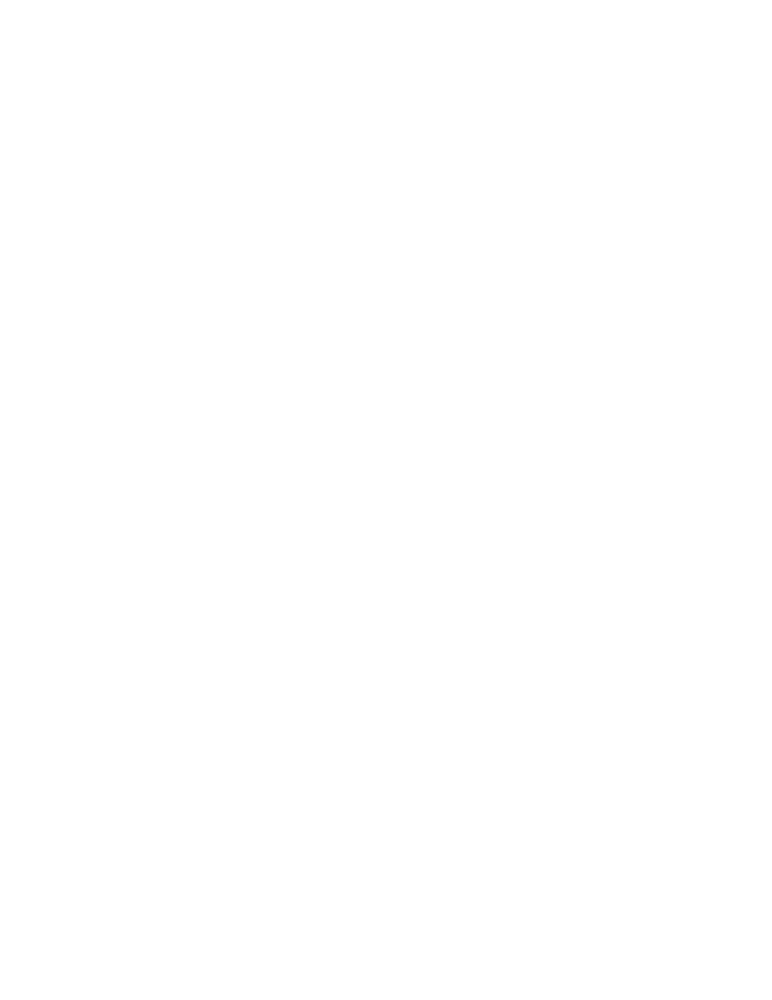
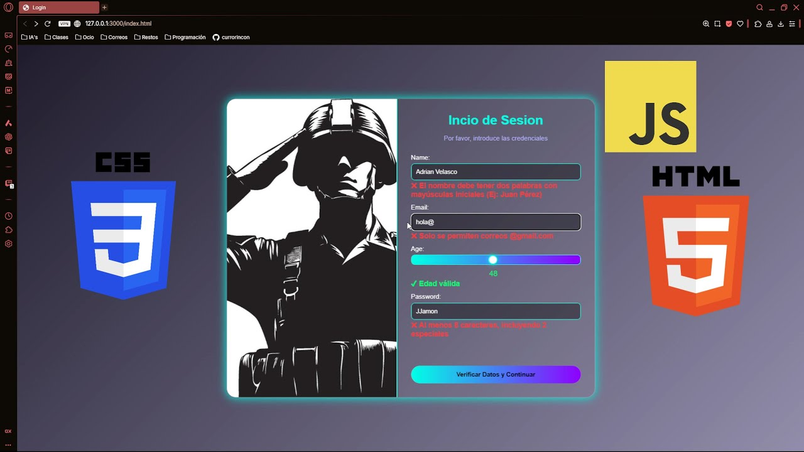
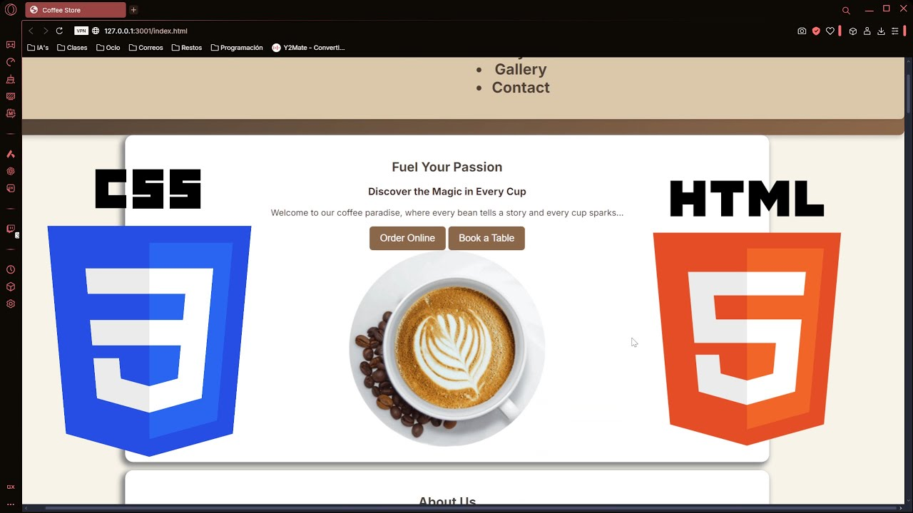

<!-- Perfil README llamativo y profesional para Coding with Adri -->

<h1 align="center">⚡ Bienvenid@ al cuartel de <span style="color:#00ffcc">Sh4d0w_err0r</span> ⚡</h1>

<p align="center">
  
</p>
```text

```

---

### 🧠 ¿Quién soy?

```txt
📛 Nombre: Adrián (alias Sh4d0w)
💻 Rol: Estudiante de Desarrollo de Aplicaciones Multiplataforma & futuro especialista en Ciberseguridad
🔥 Estado actual: Siempre aprendiendo y construyendo
🧩 Filosofía: Aprendiz de todo, maestro de nada
```

---

### ⚙️ Tecnologias que uso en mi dia a dia con pasión:

<div align="center">
  


</div>

### 🎥 Donde comparto, enseño y aprendo

<div align="center">

[](https://www.youtube.com/@CodingWithAdri-s3n)
[](https://www.twitch.tv/coding_with_adri)
[](https://discord.gg/RhYxW79r9g)

</div>

---

### 🧠 Intereses y hobbies

🎸 Tocar la guitarra y el piano  
📚 Aprender cosas nuevas todos los días  
💻 Romper y construir cosas  
🔐 Hacking ético & ciberseguridad

> _“Aprendiz de todo, maestro de nada”_ 🔥

---

### 📹 Los mejores Videos de mi Canal
<!-- BEGIN YOUTUBE-CARDS -->

| Personalización de Kali Linux | Curso de Java - Condicionales | Bot de Discord Paso a Paso |
|-------------------------------|-------------------------------|----------------------------|
| <a href="https://www.youtube.com/watch?v=eyy8SxSaon0"></a> | <a href="https://www.youtube.com/watch?v=Rh84eH2vq0I&list=PLdZNEUB9bY935wlLEYXX6GHj2COBU5ga3&index=2"></a> |<a href="https://www.youtube.com/watch?v=0ysavvaKMOw&t=2s"></a> |

| Generador de contraseñas | Verificar datos con HTML CSS y JS | Cafeteria Web con HTML, CSS  y JS |
|--------------------------|-----------------------------------|----------------------------|
| <a href="https://www.youtube.com/watch?v=eyy8SxSaon0"></a> | <a href="https://www.youtube.com/watch?v=zJ-rAZUoNMw"></a> |<a href="https://www.youtube.com/watch?v=GWD-bA8Hn0s"></a> |

<!-- Otra tabla para cuando se necesite
| Generador de contraseñas | Curso de Java - Condicionales | Bot de Discord Paso a Paso |
|-------------------------------|-------------------------------|----------------------------|
| <a href="https://www.youtube.com/watch?v=eyy8SxSaon0"></a> | <a href="https://www.youtube.com/watch?v=3EXWWySOUXY"></a> |<a href="https://www.youtube.com/watch?v=0ysavvaKMOw&t=2s"></a> |

-->

<!-- END YOUTUBE-CARDS -->


---
### 📊 ¿Quieres ver cómo me muevo en GitHub?


---

### 📫 Contacto

¿Charlamos? ¿Una colaboración? ¿Un reto de código?

- 📬 **Email**: _[sh4d0werr0rhack@gmail.com]_  

---

<p align="center"><b>Gracias por pasar por mi perfil. A hackear...</b></p>
